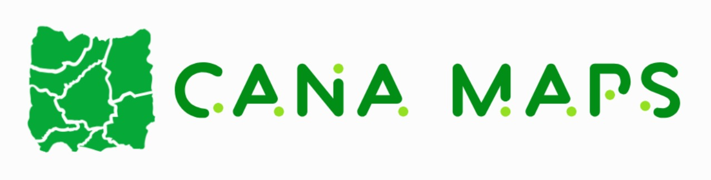
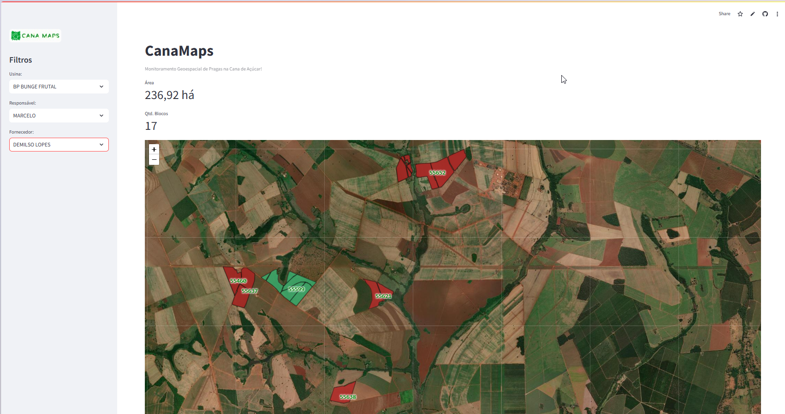

# Cana Maps 🌾📊



## Monitoramento Geoespacial de Pragas na Cana de Açúcar!

O **Cana Maps** é um sistema desenvolvido para monitorar pragas, como broquinhas e cigarrinhas, em áreas de cultivo de cana-de-açúcar. Utilizando dados de levantamentos da **APROVALE** (Associação dos Produtores de Cana do Vale do Rio Grande), o projeto visa mapear a distribuição das pragas, identificar áreas de maior incidência e fornecer informações detalhadas aos gestores através de mapas interativos. 

## 🌐 Acesse o Projeto Online  
[Cana Maps - Monitoramento Geoespacial de Pragas](https://canamaps.streamlit.app/)

## 📸 Imagens do Projeto



## 🚀 Funcionalidades
- Mapeamento geoespacial das pragas em áreas de cultivo.
- Identificação de áreas críticas de incidência.
- Visualização interativa das áreas afetadas.

## 📊 Dados Utilizados
Os dados utilizados no projeto são obtidos da **APROVALE**, incluindo informações detalhadas sobre as pragas e áreas de monitoramento.

## 🔧 Melhorias Futuras
- Implementar a tela de monitoramento de cigarrinha.
- Adicionar novas áreas de monitoramento.
- Melhorar a classificação de monitoramento com novos critérios.
- Otimizar as requisições de dados.

## 🛠️ Tecnologias Utilizadas
- Python
- Streamlit
- Folium
- GeoPandas
- Requets

## ⚙️ Como Executar o Projeto
1. Clone o repositório:
    ```bash
    git clone https://github.com/seu-usuario/cana-maps.git
    ```
2. Instale as dependências:
    ```bash
    pip install -r requirements.txt
    ```
3. Execute o projeto:
    ```bash
    streamlit run src/app.py
    ```

## 🤝 Autor
**Christophor Paiva Amorim**
- [LinkedIn](https://www.linkedin.com/in/christophor-amorim-0503a1144/)
- [Instagram](https://www.instagram.com/christophoramorim/)


Dê uma estrela ⭐ no repositório se você gostou do projeto!
